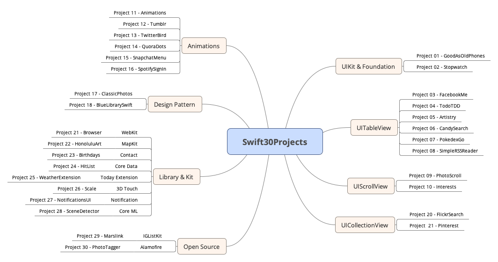

# Swift-30-Clone-Projects

개발을 배우는 가장 효과적인 방법은 프로젝트를 기준으로 코딩을 하는 것이라 생각하여, 총 30개의 앱을 클론 코딩하려 합니다.

원본 프로젝트 : [링크](https://github.com/soapyigu/Swift-30-Projects)

프로젝트로 배울 수 있는 요소는 다음과 같습니다.  

- [Project 01 - GoodAsOldPhones](https://github.com/M1zz/GoodAsOldPhones)  
  - 블로그 글 [보러가기](https://dev200ok.blogspot.com/2020/05/swift-30-projects-ios-goodasoldphones.html)
- [Project 02 - Stopwatch](https://github.com/M1zz/Stopwatch)
  - 블로그 글 [보러가기](https://dev200ok.blogspot.com/2020/06/swift-30-projects-02-ios-stopwatch.html)  
- [Project 03 - FacebookMe](https://github.com/M1zz/FacebookMe)
  - 블로그 글 [보러가기](https://dev200ok.blogspot.com/2020/06/swift-30-projects03-ios-facebookme.html)	 
- [Project 04 - TodoTDD](https://github.com/M1zz/TodoTDD)
  - 블로그 글 [보러가기](https://dev200ok.blogspot.com/2021/04/swift-30-projects-03-ios-todotdd.html)
- [Project 05 - Artistry](https://github.com/M1zz/Artistry)
  - 블로그 글 [보러가기](링크) 
- Project 06 - CandySearch  
- Project 07 - PokedexGo
- Project 08 - SimpleRSSReader
- Project 09 - PhotoScroll
- Project 10 - Interests
- Project 11 - Animations
- Project 12 - Tumblr
- Project 13 - TwitterBird
- Project 14 - QuoraDots
- Project 15 - SnapchatMenu
- Project 16 - SpotifySignIn
- Project 17 - ClassicPhotos
- Project 18 - BlueLibrarySwift
- Project 19 - Pinterest
- Project 20 - FlickrSearch	 
- Project 21 - Browser
- Project 22 - HonoluluArt
- Project 23 - Birthdays
- Project 24 - HitList
- Project 25 - WeatherExtension	 
- Project 26 - Scale
- Project 27 - NotificationsUI
- Project 28 - SceneDetector
- Project 29 - Marslink	 
- Project 30 - PhotoTagger
